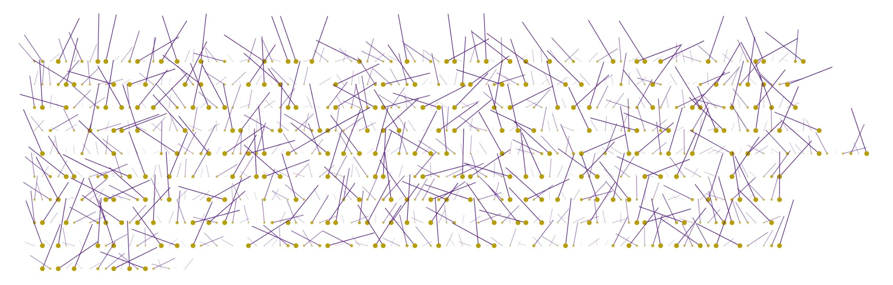

# MS_059_F21 | Python and Viz

## Professor Douglas Goodwin
## MW 2:55-4:10PM

## SC Campus, Steele Hall, 229

## [Syllabus](https://github.com/scrippscollege/MS_059_F21/) | [Discord](https://discord.gg/jaj7xcBN)



## DESCRIPTION

This is an introduction to computer programming that supports Scripps College's interdisciplinary vision. It is for everyone--visual designers, data scientists, and fine artists--who wants to create interactive media and computer graphics. This course links software concepts to principles of visual form, motion, and interaction. Students learn the fundamentals of Python programming (data structures, sequencing, selection and sorting, iteration and recursion, functions, object-oriented code) and use Processing.py to analyze and visualize data, generate drawings and sounds, manipulate images, create interactions for games, use network communication to collect data, and learn how to work with remote data to create environmental simulations. Prior programming experience not required. This course satisfies the pre-requisite for DS2 in Scripps' Data Science minor.

This class uses materials generously provided under Creative Commons licenses. These materials have been remixed for maximum benefit for students who wish to learn how to study critical data relationships using visualizations generated with Python.

Consider this statement from Charles Severance, author of "Python for Everybody" the book that provides both ballast and rudder to these materials.

^ In all cases, permission to reuse and remix this material will be granted as long as there is clear added value or benefit to students or teachers that will accrue as a result of the new work.
^ The Charles Severance www.dr-chuck.com Ann Arbor, MI, USA September 9, 2013

---
## ASSIGNMENTS

We start with the basics and add visualizations exercises to take advantage of your new skills. By the end of the class you will be able to access remote data and make graphs and other visualizations of the data either to persuade viewers to action or to consider the aesthetics of information. 

---
## OUTLINE

| **W**  | **Date**     | **theme**                            | **Slides**                                                   | **Reading**                                                  | **videos**                                                   | **Assignment**                                               | **Quiz**                                                     |
| ------ | ------------ | ------------------------------------ | ------------------------------------------------------------ | ------------------------------------------------------------ | ------------------------------------------------------------ | ------------------------------------------------------------ | ------------------------------------------------------------ |
| **1**  | 08/30, 09/01 | intro                                | [01_intro/01.pdf](01_intro/01.pdf)                           | [Chapter 1: Introduction](https://www.py4e.com/html3/01-intro) | [Why Program - Part 1](https://youtu.be/fvhNadKjE8g) [Why Program - Part 2](https://youtu.be/VQZTZsXk8sA) [Why Program - Part 3](https://youtu.be/LLzFNlCjTSo) [Why Program - Part 4](https://youtu.be/gsry2SYOFCw) [Writing ‘hello world’ in the Autograder](https://www.py4e.com/lessons/intro#) | [Autograder: Write Hello World](https://www.py4e.com/lessons_launch/pythonauto_01_hello) \| git | [Quiz: Why program?](https://www.py4e.com/lessons_launch/py4e_01_in_quiz) |
| **2**  | 09/06, 09/08 | Variables, Expressions, & Statements | [Pythonlearn–02-Expressions.pptx](https://www.py4e.com/lectures3/Pythonlearn-02-Expressions.pptx) | [Chapter 2: Variables](https://www.py4e.com/html3/02-variables) | [Variables, Expressions, and Statements - Part 1](https://youtu.be/7KHdV6FSpo8) [Variables, Expressions, and Statements - Part 2](https://youtu.be/kefrGMAglGs) [Worked Exercise: 2.2](https://youtu.be/_b-nVJrl02M) [Worked Exercise: 2.3](https://youtu.be/DVmspDooG2c) | [Autograder: Exercise 2.3](https://www.py4e.com/lessons_launch/pythonauto_02_03) | [Quiz: Variables, Expressions, and Statements](https://www.py4e.com/lessons_launch/py4e_02_ex_quiz) |
| **3**  | 09/13, 09/15 | Conditional execution                | [Pythonlearn–03-Conditional.pptx](https://www.py4e.com/lectures3/Pythonlearn-03-Conditional.pptx) | [Chapter 3: Conditionals](https://www.py4e.com/html3/03-conditional) | [Conditional Execution - Part 1](https://youtu.be/2aA3VBdcl6A) [Conditional Execution - Part 2](https://youtu.be/OczkNrHPBps) [Worked Exercise 3.1](https://youtu.be/oUMQbZ4SBuM) [Worked Exercise 3.2](https://youtu.be/-iUA4cCKRlM) | [Autograder: Exercise 3.1](https://www.py4e.com/lessons_launch/pythonauto_03_01) [Autograder: Exercise 3.3](https://www.py4e.com/lessons_launch/pythonauto_03_03) | [Quiz: Conditional Execution](https://www.py4e.com/lessons_launch/py4e_03_if_quiz) |
| **4**  | 09/20, 09/22 | functions                            | [Pythonlearn–04-Functions.pptx](https://www.py4e.com/lectures3/Pythonlearn-04-Functions.pptx) | [Chapter 4: Functions](https://www.py4e.com/html3/04-functions) | [Functions - Part 1](https://youtu.be/5Kzw-0-DQAk) [Functions - Part 2](https://youtu.be/AJVNYRqn8kM) [Worked Exercise 4.6](https://www.py4e.com/lessons/functions#) | [Autograder: Exercise 4.6](https://www.py4e.com/lessons_launch/pythonauto_04_06) | [Quiz: Functions](https://www.py4e.com/lessons_launch/py4e_04_def_quiz) |
| **5**  | 09/27, 09/29 | Iteration                            | [Pythonlearn–05-Iterations.pptx](https://www.py4e.com/lectures3/Pythonlearn-05-Iterations.pptx) | [Chapter 5: Iterations](https://www.py4e.com/html3/05-iterations) | [Loops and Iteration - Part 1](https://youtu.be/FzpurxjwmsM) [Loops and Iteration - Part 2](https://youtu.be/5QDrj5ogPYc) [Loops and Iteration - Part 3](https://youtu.be/xsavQp8hd78) [Loops and Iteration - Part 4](https://youtu.be/yjlMMwf9Y5I) Worked Exercise 5.1 | [Autograder: Exercise 5.2](https://www.py4e.com/lessons_launch/pythonauto_05_02) | [Quiz: Loops and Iterations](https://www.py4e.com/lessons_launch/py4e_05_for_quiz) |
| **6**  | 10/04, 10/06 | recursion                            | [Pythonlearn–06-Strings.pptx](https://www.py4e.com/lectures3/Pythonlearn-06-Strings.pptx) | [Chapter 6: Strings](https://www.py4e.com/html3/06-strings)  | [Strings Part 1](https://youtu.be/dr98iM4app8) [Strings Part 2](https://youtu.be/bIFpJ-qZ3Cc) [Worked Exercise 6.5](https://youtu.be/BGTxwsDI9KY) | [Autograder: Exercise 6.5](https://www.py4e.com/lessons_launch/pythonauto_06_05) | [Quiz: Strings](https://www.py4e.com/lessons_launch/py4e_06_str_quiz) |
| **7**  | 10/11, 10/13 | strings & files                      | [Pythonlearn–07-Files.pptx](https://www.py4e.com/lectures3/Pythonlearn-07-Files.pptx) | [Chapter 7: Files](https://www.py4e.com/html3/07-files)      | [Reading Files - Part 1](https://youtu.be/9KJ-XeQ6ZlI) [Reading Files - Part 2](https://youtu.be/0t4rvnySKR4) [Worked Exercise 7.1](https://youtu.be/MHZ4KnFZ7Y0) | [Autograder: Exercise 7.2](https://www.py4e.com/lessons_launch/pythonauto_07_02) | [Quiz: Files](https://www.py4e.com/lessons_launch/py4e_07_files_quiz) |
| **8**  | 10/18,10/20  | —fall break —                        |                                                              |                                                              |                                                              |                                                              |                                                              |
| **9**  | 10/25, 10/27 | lists                                | [Pythonlearn–08-Lists.pptx](https://www.py4e.com/lectures3/Pythonlearn-08-Lists.pptx) | [Chapter 8: Lists](https://www.py4e.com/html3/08-lists)      | [Lists - Part 1](https://youtu.be/ljExWqnWQvo) [Lists - Part 2](https://youtu.be/bV1FQUBIApM) [Lists - Part 3](https://youtu.be/GxADdpo6EP4) [Lists, Files, and the Guardian Pattern](https://youtu.be/WU6_0A9zYRA) | [Autograder: Exercise 8.4](https://www.py4e.com/lessons_launch/pythonauto_08_04) [Autograder: Exercise 8.5](https://www.py4e.com/lessons_launch/pythonauto_08_05) | [Quiz: Lists](https://www.py4e.com/lessons_launch/py4e_08_list_quiz) |
| **10** | 11/01, 11/03 | dictionaries                         | [Pythonlearn–09-Dictionaries.pptx](https://www.py4e.com/lectures3/Pythonlearn-09-Dictionaries.pptx) | [Chapter 9: Dictionaries](https://www.py4e.com/html3/09-dictionaries) [Fun: Sesame Street - The Count](https://www.youtube.com/watch?v=EHJ9uYx5L58) | [Dictionaries - Part 1](https://youtu.be/yDDRMb-1cxI) [Dictionaries - Part 2](https://youtu.be/LRSIuH94XM4) [Dictionaries - Part 3](https://youtu.be/ZDjiFB1Ib84) [Counting Word Frequency using a Dictionary](https://youtu.be/lLbyEYjU55A) | [Autograder: Exercise 9.4](https://www.py4e.com/lessons_launch/pythonauto_09_04) | [Quiz: Dictionaries](https://www.py4e.com/lessons_launch/py4e_09_dict_quiz) |
| **11** | 11/08, 11/10 | tuples                               | [Pythonlearn–10-Tuples.pptx](https://www.py4e.com/lectures3/Pythonlearn-10-Tuples.pptx) | [Chapter 10: Tuples](https://www.py4e.com/html3/10-tuples)   | [Tuples - Part 1](https://youtu.be/CaVhM65wD6g) [Tuples - Part 2](https://youtu.be/FdUdA6o0Ij0) [Sorting a Dictionary Using Tuples](https://youtu.be/hMJpet-gtc0) | [Autograder: Exercise 10.2](https://www.py4e.com/lessons_launch/pythonauto_10_02) | [Quiz: Tuples](https://www.py4e.com/lessons_launch/py4e_10_tup_quiz) |
| **12** | 11/15, 11/17 | TBA                                  |                                                              |                                                              |                                                              |                                                              |                                                              |
| **13** | 11/22, 11/24 | TBA                                  |                                                              |                                                              |                                                              |                                                              |                                                              |
| **14** | 11/29, 12/01 | Project work                         |                                                              |                                                              |                                                              |                                                              |                                                              |
| **15** | 12/06, 12/08 | Show projects                        |                                                              |                                                              |                                                              |                                                              |                                                              |


[Jupyter](https://github.com/scrippscollege/MS_059_F21/blob/main/01_intro/PY4E_01.ipynb) |
[Colab](https://colab.research.google.com/github/scrippscollege/MS_059_F21/blob/main/01_intro/PY4E_01.ipynb) |
[Nextjournal](https://github.nextjournal.com/scrippscollege/MS_059_F21/tree/01_intro/PY4E_01.ipynb) |
[Deepnote](https://deepnote.com/launch?url=https://github.com/scrippscollege/MS_059_F21/blob/main/01_intro/PY4E_01.ipynb)


---

## 12/ [csv and json](11_csv+json)
- session 1 (M 11/15)
- session 2 (M 11/17)

## 13/ [oop](12_oop)
- session 1 (M 11/22)
- session 2 (M 11/24)

## 14/ [apis](13_apis)
- session 1 (M 11/29)
- session 2 (M 12/01)

## 15/ [projects](15_projects)
- session 1 (M 12/06)
- session 2 (M 12/08


## COURSE POLICIES

### Scripps College Grade policy

Academic evaluation at Scripps College is a system of letter grades with grade points assigned according to the following scale:

```
12.0	11.0	10.0	9.0	8.0	 
A	A–	B+	B	B–	 

7.0	6.0	5.0	4.0	3.0	0
C+	C	C–	D+	D	F
```

The minimum passing grade is a "D" for any course taken at the Claremont Colleges. Letter grades on file with the Registrar at the end of the semester are final unless an error in calculating the grade is discovered. Errors must be corrected within one year of the time the grade was recorded.

### Scripps College Policy on Class Attendance

Students are expected to attend all classes and not to be absent without adequate reason. The regulation of class attendance is ultimately the responsibility of the faculty. It is particularly important that students attend those classes immediately preceding and following vacation periods.


### Late Submissions

Unless otherwise approved, work is to be turned in on time or a penalty will be applied for every class it is late. You must accompany the work to the critique and be present throughout or points will be deducted. Students are also expected to prepare the readings and viewings for an assigned date before class meets.

### Learning Environment
I hope that this class will serve students from all backgrounds and perspectives, and that students’ learning needs be addressed both in and out of class. The diversity that students bring to this class is a gift that conveys strengths and benefits to all. I intend to present materials that are respectful of student diversity. Your suggestions towards this end are encouraged and appreciated, and I hope that you will tell me how to improve the effectiveness of the course for you personally or for other students and groups.

Note that the history and practice of computer programming is spangled with charged language and has a history of discrimination. I hope that you will see this as an opportunity to challenge this corner of the cultural hegemony.

### Writing Center
You are encouraged to seek support at the Writing Center on your home campus to assist with your writing process.

### Accommodations
Scripps College values diversity and inclusion; we are committed to a climate of mutual respect and full participation. As such, our goal is to create learning environments that are equitable, inclusive and welcoming. If you anticipate or experience any barriers to learning related to a disability or condition, please meet with me or reach out to the Office of Academic Resources and Services at [ars@scrippscollege.edu](mailto:ars@scrippscollege.edu). ARS will work with you to discuss your experiences and a range of options to ensure your full participation in this course and others.

Please note that a student’s home campus is responsible for establishing and providing accommodations. If you are not a Scripps student, you must contact your home institution to establish accommodations. Below is a list of coordinators on the other campuses:

· CMC: Kari Rood, [kari.rood@claremontmckenna.edu](mailto:kari.rood@claremontmckenna.edu)
· HMC: Brandon Ice, [bice@g.hmc.edu](mailto:bice@g.hmc.edu)
· Pitzer: Gabriella Tempestoso, [gabriella_tempestoso@pitzer.edu](mailto:gabriella_tempestoso@pitzer.edu)
· Pomona: Mace Fuataina Mikaele, [mace.mikaele@pomona.edu](mailto:mace.mikaele@pomona.edu)
· Claremont Graduate Institute: Madeline Kiuttu, [madeleine.kiuttu@cgu.edu](mailto:madeleine.kiuttu@cgu.edu)
· Keck Graduate Institute: Andrea Mozqueda, [andrea_mozqueda@kgi.edu](mailto:andrea_mozqueda@kgi.edu)

### Scripps College Policy on Dishonesty
Cheating and/or plagiarism seriously violate the principles of academic integrity that Scripps College expects its students to uphold. Academic dishonesty is not tolerated at Scripps and may result in suspension or expulsion from the College. (See the [current Guide to Student Life](http://inside.scrippscollege.edu/studentaffairs/wp-content/uploads/sites/26/files/2018-19-GTSL.08.19.pdf).)
